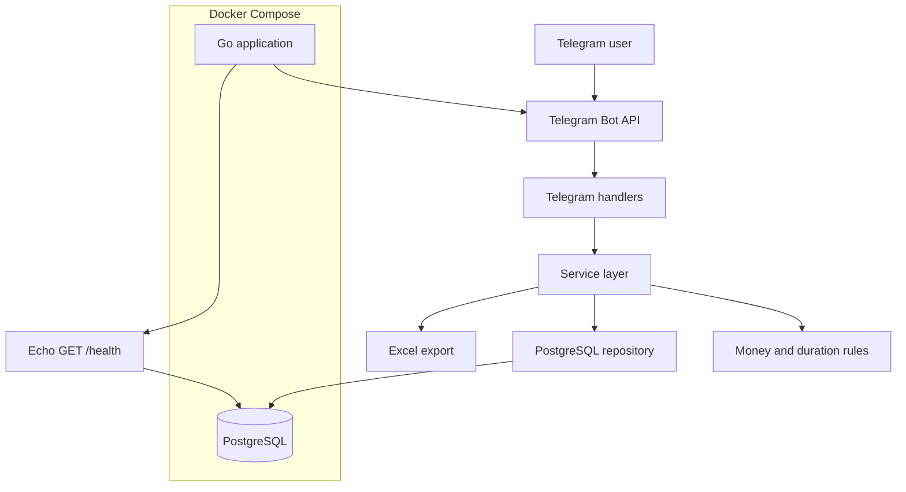

# Dev Work Tracker

> Telegram-бот на Go для ручного учёта выполненных работ, затраченного времени и стоимости с месячными отчётами, Excel-экспортом и учётом оплат.


Dev Work Tracker предназначен для почасовой модели работы. Пользователь вручную фиксирует проект, описание результата, дату и затраченное время, а бот сохраняет историю, рассчитывает стоимость и собирает данные в месячные отчёты.

## Содержание

- [Возможности](#возможности)
- [Как это работает](#как-это-работает)
- [Архитектура](#архитектура)
- [Денежные расчёты](#денежные-расчёты)
- [Время и отчёты](#время-и-отчёты)
- [Excel-экспорт](#excel-экспорт)
- [Технологии](#технологии)
- [Структура проекта](#структура-проекта)
- [База данных](#база-данных)
- [Локальный запуск](#локальный-запуск)
- [Конфигурация](#конфигурация)
- [Тестирование](#тестирование)
- [Безопасность](#безопасность)
- [Статус проекта](#статус-проекта)

## Возможности

### Проекты

- создание проекта с индивидуальной почасовой ставкой;
- изменение названия и текущей ставки;
- деактивация проекта;
- сохранение snapshot ставки в каждой уже созданной записи.

Изменение ставки проекта не пересчитывает старые работы.

### Учёт работ

- ручное добавление описания выполненной работы;
- выбор проекта и даты;
- быстрые действия «Сегодня» и «Вчера»;
- ручной ввод даты в формате `ДД.ММ.ГГГГ`;
- preview перед сохранением;
- просмотр, редактирование и удаление записей.

### Ввод времени

Парсер принимает разные пользовательские форматы, например:

- `1 час 30 мин`;
- `90 мин`;
- `1:30`;
- `1,5 часа`;
- `2ч`;
- `135 мин`.

После проверки значение нормализуется в целочисленный `duration_seconds`.

### Месячные отчёты

- количество работ и суммы по каждому проекту;
- общий заработок за месяц;
- время в часах и минутах и отдельное количество минут;
- переход к предыдущему и следующему календарному месяцу;
- ручной выбор месяца;
- блокировка перехода в будущие месяцы.

### Оплаты

Для пары проект + календарный месяц хранится статус `pending` или `paid`. При отметке оплаты сохраняется `paid_at`; статус можно вернуть обратно.

## Как это работает

Основной интерфейс построен на Telegram inline-кнопках:

```text
➕ Добавить работу
📋 Мои работы
📊 Отчёт
📤 Excel
📁 Проекты
💳 Оплаты
```

Типовой сценарий:

1. Нажать «Добавить работу».
2. Выбрать проект.
3. Ввести описание.
4. Выбрать дату.
5. Указать затраченное время.
6. Проверить preview.
7. Сохранить запись.

Нейтральный пример расчёта:

```text
Проект: Internal CRM
Работа: Добавлена фильтрация заявок по статусу
Ставка: 2 000 ₽/ч
Время: 1 час 30 мин
Стоимость: 3 000 ₽
```

Поддерживаемые команды: `/start`, `/new`, `/report`, `/export`, `/projects`, `/payments`, `/cancel`. Основной UX работает через кнопки.

## Архитектура



Telegram handlers отвечают за пользовательские сценарии и callback-навигацию. Бизнес-правила находятся в service layer, SQL изолирован в repository, а `/health` отдельно проверяет доступность PostgreSQL.

## Денежные расчёты

Денежные значения не рассчитываются через `float64`. Ставки и стоимость хранятся как `int64` в копейках.

Стоимость отдельной работы округляется до ближайшей копейки на backend:

```text
amount_kopecks =
    (hourly_rate_kopecks * duration_seconds + 1800) / 3600
```

Пример:

```text
2 000 ₽/ч × 1 ч 20 мин = 2 666,67 ₽
```

Месячный итог — сумма сохранённых `amount_kopecks` всех `WorkEntry`, а не повторный расчёт общих часов по ставке. Благодаря этому сохраняется индивидуальное округление каждой записи.

## Время и отчёты

Источник истины для длительности — `duration_seconds`. В отчёте значение одновременно представлено в удобном формате и в целых минутах:

```text
Фактическое время: 11 ч 35 мин (695 мин)
```

Количество минут рассчитывается целочисленно: `duration_seconds / 60`.

Навигация использует календарные месяцы, включая переходы декабрь → январь и январь → декабрь. Кнопка следующего месяца скрывается для текущего месяца, а переход в будущее дополнительно блокируется обработчиком. Пользовательские границы месяца определяются в `Europe/Moscow`.

## Excel-экспорт

Экспорт формирует светлый `.xlsx` за выбранный месяц по всем проектам или по одному проекту.

| Колонка | Содержимое |
|---|---|
| `№` | Порядковый номер |
| `Дата` | Логическая дата работы |
| `Проект` | Название проекта |
| `Выполненная работа` | Описание с `WrapText` |
| `Время` | Человекочитаемая длительность |
| `Время, мин` | Целое числовое значение |
| `Ставка, ₽/ч` | Числовая ставка |
| `Стоимость, ₽` | Числовая стоимость |

Итоговый блок содержит количество работ, общее время, всего минут и итоговую сумму. Денежные и минутные значения записываются как числа, поэтому их можно использовать для фильтрации и дальнейших вычислений в Excel.

## Технологии

| Компонент | Технология |
|---|---|
| Язык | Go 1.24 |
| Telegram | `github.com/go-telegram/bot` |
| HTTP | Echo |
| База данных | PostgreSQL 17 |
| PostgreSQL driver | pgx / pgxpool |
| Миграции | goose |
| Excel | Excelize |
| Контейнеризация | Docker, Docker Compose |

## Структура проекта

```text
cmd/server/              точка входа приложения
internal/config/         загрузка и валидация environment variables
internal/domain/         бизнес-модели
internal/duration/       парсер и форматирование длительности
internal/export/         генерация XLSX
internal/httpserver/     HTTP server и GET /health
internal/money/          целочисленная денежная математика
internal/repository/     PostgreSQL-запросы
internal/service/        бизнес-правила и агрегация отчётов
internal/storage/        подключение к PostgreSQL
internal/telegram/       меню, callbacks и пользовательские сценарии
migrations/              SQL migrations для goose
```

## База данных

| Таблица | Назначение |
|---|---|
| `projects` | Проекты, текущие ставки и статус активности |
| `work_entries` | Выполненные работы, время, snapshot ставки и стоимость |
| `payment_periods` | Статус оплаты проекта за календарный месяц |

Ключевые поля `work_entries`:

- `duration_seconds` — длительность работы;
- `hourly_rate_kopecks` — ставка на момент создания записи;
- `amount_kopecks` — рассчитанная стоимость.

Технические timestamps хранятся как `TIMESTAMPTZ`. Пользовательские календарные операции выполняются в `Europe/Moscow`, а `work_date` представляет логическую дату работы.

## Локальный запуск

### Требования

- Docker Engine и Docker Compose;
- Telegram bot token от BotFather;
- Telegram User ID для allowlist;
- goose v3.24.3 для применения миграций.

```bash
git clone https://github.com/nikndip/dev-work-tracker.git
cd dev-work-tracker
cp .env.example .env
```

Заполните `.env` локальными значениями, затем запустите PostgreSQL:

```bash
docker compose up -d postgres
```

Перед первым запуском примените миграции из среды, которая видит PostgreSQL по адресу из `DATABASE_URL`:

```bash
go install github.com/pressly/goose/v3/cmd/goose@v3.24.3
goose -dir migrations postgres "$DATABASE_URL" up
```

В Compose PostgreSQL намеренно не публикуется на host. Поэтому Goose можно запускать внутри compose network либо использовать локальный PostgreSQL, доступный из host-среды.

После применения миграций:

```bash
docker compose up -d --build
docker compose ps
curl http://127.0.0.1:8080/health
```

Остановка без удаления persistent volume:

```bash
docker compose down
```

Не используйте `docker compose down -v`, если данные нужно сохранить.

## Конфигурация

Приложение получает конфигурацию только через environment variables.

| Переменная | Обязательная | Назначение |
|---|---:|---|
| `TELEGRAM_BOT_TOKEN` | да | Token Telegram Bot |
| `TELEGRAM_ALLOWED_USER_ID` | да | Разрешённый пользователь |
| `DATABASE_URL` | да | PostgreSQL connection string |
| `DEFAULT_TIMEZONE` | да | Пользовательская IANA timezone |
| `DEFAULT_HOURLY_RATE_KOPECKS` | да | Ставка нового проекта по умолчанию в копейках |
| `HTTP_ADDRESS` | нет | HTTP address, по умолчанию `:8080` |

Docker Compose также использует `POSTGRES_DB`, `POSTGRES_USER` и `POSTGRES_PASSWORD`. Файл `.env.example` содержит только development placeholders; рабочий `.env` исключён из Git.

## Тестирование

```bash
go test -count=1 ./...
go vet ./...
docker compose config --quiet
```

Также доступен Linux test-target:

```bash
docker build --target test -t dev-work-tracker-test .
```

Тесты проверяют:

- денежное округление и сумму отдельных `WorkEntry`;
- парсер длительности;
- snapshot ставки и перерасчёт после изменения времени;
- границы месяца и агрегацию отчётов;
- Telegram callbacks, «Сегодня» и «Вчера»;
- previous/next month и запрет будущего месяца;
- структуру, стили, денежные итоги и числовые минуты в Excel.

## Production

Текущее развёртывание использует Ubuntu 24.04 LTS, Docker Engine, Docker Compose, PostgreSQL, UFW и SSH key authentication. Внутренние адреса, учётные данные и параметры сервера в репозитории не публикуются.

## Безопасность

- secrets передаются через environment variables;
- `.env` исключён из Git;
- сообщения и callback-запросы защищены Telegram allowlist;
- PostgreSQL не публикуется наружу через Compose;
- HTTP endpoint привязан к loopback-интерфейсу host;
- production-контейнер работает от непривилегированного пользователя;
- production Git access может использовать read-only deploy key;
- деньги хранятся как целые значения в копейках;
- логи не содержат bot token и полный `DATABASE_URL`.

## Статус проекта

Проект находится в активной разработке. Основной MVP реализован и используется: доступны проекты, ручной учёт и редактирование работ, месячные отчёты, Excel-экспорт, статусы оплат и навигация по месяцам.

### Возможные дальнейшие улучшения

- расширенная аналитика;
- дополнительные форматы отчётов;
- дальнейшее улучшение Telegram UX;
- дополнительные способы представления рабочего времени.
